# 💳 Sistema de Pagos Provisionales con Tarjetas de Crédito

Sistema completo para registrar pagos con múltiples tarjetas de crédito usando tasas provisionales, y luego confirmarlos con las tasas reales cuando se pagan los estados de cuenta.

---

## 📋 Índice

1. [Resumen Ejecutivo](#-resumen-ejecutivo)
2. [Problema y Solución](#-problema-y-solución)
3. [Análisis de Arquitectura Actual](#-análisis-de-arquitectura-actual)
4. [Plan de Implementación](#-plan-de-implementación)
5. [Fases de Implementación](#-fases-de-implementación)
6. [Guía para Desarrolladores](#-guía-para-desarrolladores)
7. [Testing](#-testing)
8. [Troubleshooting](#-troubleshooting)

---

## 🎯 Resumen Ejecutivo

### El Problema

Cuando se realiza un pago a una orden de compra usando tarjetas de crédito:

1. **Momento del pago** (ej: 15 Dic):
   - Se paga la orden usando 2-5 tarjetas diferentes
   - Se usa tasa de cambio **estimada** (~58 RD$/USD)
   - No se conoce el costo real todavía

2. **15-30 días después** - Llega el estado de cuenta:
   - Cada tarjeta aplicó su **tasa real** (ej: 59.2, 58.8)
   - Hay comisiones adicionales del banco
   - El costo real **difiere** del estimado

3. **Necesidad**:
   - Registrar el pago inicial con tasas provisionales
   - Actualizar con tasas reales cuando se pague la tarjeta
   - Trackear diferencias para análisis de costos
   - Alertas de pagos pendientes de confirmar

### La Solución

Sistema de **pagos provisionales con confirmación posterior**:

- ✅ Estado "Provisional" vs "Confirmado"
- ✅ Desglose de múltiples tarjetas (hasta 5+)
- ✅ Tasas provisionales y tasas reales
- ✅ Cálculo automático de diferencias
- ✅ Alertas de pagos por confirmar
- ✅ Reportes de variación de tasas

---

## 🔍 Problema y Solución

### Flujo Actual (Sin el sistema)

```
Usuario paga orden → Crea pago con tasa del día
                   ↓
                   ? (No sabe tasa real hasta recibir estado de cuenta)
                   ↓
                   ❌ Costos incorrectos en reportes
                   ❌ No hay trazabilidad de qué tarjeta usó
                   ❌ No hay control de diferencias
```

### Flujo Mejorado (Con el sistema)

```
FASE 1: CREAR PAGO PROVISIONAL
━━━━━━━━━━━━━━━━━━━━━━━━━━━━━━
Usuario paga orden
  ↓
Selecciona "Tarjeta de Crédito"
  ↓
Agrega cada tarjeta:
  • Visa Popular 4532: $600 × 58.0 = RD$34,800
  • Mastercard BHD 5412: $400 × 58.0 = RD$23,200
  ↓
Total Provisional: RD$58,000
  ↓
Estado: ⚠️ PROVISIONAL
  ↓
✅ Pago registrado con tasas estimadas


FASE 2: ESPERA (15-30 días)
━━━━━━━━━━━━━━━━━━━━━━━━━━
Dashboard muestra: "⚠️ 3 pagos por confirmar"
Alertas periódicas
  ↓
Llegan estados de cuenta
  ↓
Usuario revisa tasas reales


FASE 3: CONFIRMAR PAGO
━━━━━━━━━━━━━━━━━━━━━━━━━━━━
Usuario abre pago provisional
  ↓
Click: "✅ Confirmar con Datos Reales"
  ↓
Modal muestra lado a lado:
  PROVISIONAL          REAL
  $600 × 58.0         $600 × 59.2 + RD$120
  $400 × 58.0         $400 × 58.8 + RD$80
  ───────────         ───────────────────
  RD$58,000          RD$59,040
  ↓
Diferencia: +RD$1,040 (+1.79%)
  ↓
Confirma → Estado: ✅ CONFIRMADO
  ↓
✅ Montos actualizados
✅ Costos recalculados
✅ Audit log del ajuste
```

---

## 🏗️ Análisis de Arquitectura Actual

### Stack Técnico

```typescript
// Frontend
- Next.js 14 (App Router)
- React 18 + TypeScript
- React Hook Form + Zod
- TanStack Query (React Query)
- Tailwind CSS + Shadcn UI

// Backend
- Next.js API Routes
- Prisma ORM
- PostgreSQL
- Redis (caching)

// Real-time & Others
- Pusher (presence & events)
- Zod (validations)
- Rate limiting
- Audit logging
- S3/Cloudinary (uploads)
```

### Modelo Actual: PagosChina

```prisma
model PagosChina {
  id               String   @id @default(cuid())
  idPago           String   @unique @map("id_pago")
  ocId             String   @map("oc_id")
  fechaPago        DateTime @map("fecha_pago")
  tipoPago         String   @map("tipo_pago")
  metodoPago       String   @map("metodo_pago")
  moneda           String
  montoOriginal    Decimal  @map("monto_original") @db.Decimal(12, 2)
  tasaCambio       Decimal  @default(1) @map("tasa_cambio") @db.Decimal(8, 4)
  comisionBancoUSD Decimal  @default(0) @map("comision_banco_usd") @db.Decimal(10, 2)
  montoRD          Decimal? @map("monto_rd") @db.Decimal(12, 2)
  montoRDNeto      Decimal? @map("monto_rd_neto") @db.Decimal(12, 2)
  adjuntos         Json?

  // Relaciones
  ocChina OCChina @relation(fields: [ocId], references: [id], onDelete: Cascade)

  // Timestamps
  createdAt DateTime  @default(now()) @map("created_at")
  updatedAt DateTime  @updatedAt @map("updated_at")
  deletedAt DateTime? @map("deleted_at")

  @@index([ocId])
  @@index([tipoPago])
  @@index([metodoPago])
  @@index([fechaPago])
  @@index([moneda])
  @@index([deletedAt])
  @@map("pagos_china")
}
```

### Campos a Agregar

```prisma
// Nuevos campos
estado                String?   @default("confirmado")  // "provisional" | "confirmado"
desgloseTarjetas      Json?                             // {provisional: [...], confirmado: [...]}
fechaConfirmacion     DateTime? @map("fecha_confirmacion")
diferenciaAjuste      Decimal?  @map("diferencia_ajuste") @db.Decimal(12, 2)
notasConfirmacion     String?   @map("notas_confirmacion") @db.Text

// Índices adicionales
@@index([estado])
```

### Estructura de desgloseTarjetas (JSON)

```typescript
interface DesgloseTarjetas {
  // Datos provisionales (al crear)
  provisional: TarjetaProvisional[]

  // Datos confirmados (al confirmar)
  confirmado?: TarjetaConfirmada[]

  // Metadata
  fechaConfirmacion?: string
  usuarioConfirmacion?: string
}

interface TarjetaProvisional {
  tarjeta: string // "Visa Popular 4532"
  montoUSD: number // 600
  tasaEstimada: number // 58.0
  estimadoRD: number // 34800
}

interface TarjetaConfirmada {
  tarjeta: string // "Visa Popular 4532"
  montoUSD: number // 600
  tasaReal: number // 59.2
  comisiones: number // 120
  realRD: number // 35520
  diferencia: number // +720
}
```

### Sistema de Cálculos Actual

El proyecto usa `/lib/calculations.ts` con funciones especializadas:

```typescript
// Conversión de moneda
calcularMontoRD(montoOriginal, moneda, tasaCambio)
  → Convierte USD/CNY a RD$ usando currency.js (precisión decimal)

// Costo neto (incluye comisiones)
calcularMontoRDNeto(montoRD, comisionBancoRD)
  → Suma monto + comisión = costo total real

// Tasa promedio ponderada
calcularTasaCambioPromedio(pagos)
  → Promedio ponderado por monto (no simple)
  → Ejemplo: (100×58 + 900×60)/1000 = 59.8

// Distribución de gastos
distribuirGastosLogisticos(items, gastos, pagos)
  → Distribuye gastos proporcionalmente por FOB
```

### API Routes Existentes

```
POST   /api/pagos-china          → Crear pago
GET    /api/pagos-china          → Listar pagos
GET    /api/pagos-china/[id]     → Ver pago
PUT    /api/pagos-china/[id]     → Actualizar pago
DELETE /api/pagos-china/[id]     → Eliminar pago (soft delete)

POST   /api/pagos-china/[id]/attachments  → Agregar adjuntos
DELETE /api/pagos-china/[id]/attachments  → Eliminar adjunto
```

### Componentes UI Existentes

```
/components/forms/PagosChinaForm.tsx
  → Formulario de crear/editar pago
  → React Hook Form + Zod
  → Carga dinámica de OCs y configuraciones

/app/(pages)/pagos-china/page.tsx
  → Lista de pagos con tabla virtualizada
  → Stats cards (totales, por moneda)
  → Filtros y búsqueda
  → Real-time con Pusher

/app/(pages)/pagos-china/[id]/page.tsx
  → Vista detallada de pago
  → Adjuntos
  → Editing presence
```

---

## 📐 Plan de Implementación

### Visión General

```
FASE 1: Base de Datos y Validaciones (1-1.5h)
  → Migración Prisma
  → Schemas Zod
  → Helpers de cálculo

FASE 2: API Endpoints (1.5h)
  → Modificar POST /api/pagos-china
  → Crear POST /api/pagos-china/[id]/confirmar
  → Actualizar cálculos en dashboard

FASE 3: Formulario de Creación (1.5h)
  → Campo "Desglose de Tarjetas"
  → Validaciones
  → Suma automática

FASE 4: Modal de Confirmación (1.5h)
  → Interfaz lado a lado
  → Cálculo de diferencias
  → Confirmación

FASE 5: UI/UX Enhancements (1h)
  → Badges de estado
  → Filtros
  → Stats de pagos provisionales

FASE 6: Dashboard y Alertas (1h)
  → Widget "Pagos por Confirmar"
  → Notificaciones
  → Reportes de diferencias

TOTAL: ~8 horas
```

### Dependencias

```mermaid
graph TD
    A[Fase 1: DB] --> B[Fase 2: API]
    B --> C[Fase 3: Formulario]
    B --> D[Fase 4: Confirmación]
    C --> E[Fase 5: UI/UX]
    D --> E
    E --> F[Fase 6: Dashboard]
```



---

## 🚀 Fases de Implementación

## FASE 1: Base de Datos y Validaciones

**Duración**: 1-1.5 horas
**Objetivo**: Extender el modelo de datos y validaciones

### 1.1 Migración de Prisma

**Archivo**: `prisma/schema.prisma`

```prisma
// ANTES
model PagosChina {
  id               String   @id @default(cuid())
  idPago           String   @unique @map("id_pago")
  ocId             String   @map("oc_id")
  fechaPago        DateTime @map("fecha_pago")
  tipoPago         String   @map("tipo_pago")
  metodoPago       String   @map("metodo_pago")
  moneda           String
  montoOriginal    Decimal  @map("monto_original") @db.Decimal(12, 2)
  tasaCambio       Decimal  @default(1) @map("tasa_cambio") @db.Decimal(8, 4)
  comisionBancoUSD Decimal  @default(0) @map("comision_banco_usd") @db.Decimal(10, 2)
  montoRD          Decimal? @map("monto_rd") @db.Decimal(12, 2)
  montoRDNeto      Decimal? @map("monto_rd_neto") @db.Decimal(12, 2)
  adjuntos         Json?

  // Relaciones
  ocChina OCChina @relation(fields: [ocId], references: [id], onDelete: Cascade)

  // Timestamps
  createdAt DateTime  @default(now()) @map("created_at")
  updatedAt DateTime  @updatedAt @map("updated_at")
  deletedAt DateTime? @map("deleted_at")

  @@index([ocId])
  @@index([tipoPago])
  @@index([metodoPago])
  @@index([fechaPago])
  @@index([moneda])
  @@index([deletedAt])
  @@map("pagos_china")
}

// DESPUÉS (agregar estos campos)
model PagosChina {
  // ... campos existentes ...

  // NUEVOS CAMPOS
  estado               String?   @default("confirmado") // "provisional" | "confirmado"
  desgloseTarjetas     Json?     @map("desglose_tarjetas")
  fechaConfirmacion    DateTime? @map("fecha_confirmacion")
  diferenciaAjuste     Decimal?  @map("diferencia_ajuste") @db.Decimal(12, 2)
  notasConfirmacion    String?   @map("notas_confirmacion") @db.Text

  // ... timestamps y relaciones ...

  @@index([estado])
  @@map("pagos_china")
}
```

**Comando de migración**:

```bash
# 1. Crear migración
npx prisma migrate dev --name add_pagos_provisionales_fields

# 2. Si hay error, ejecutar SQL manual
```

**SQL Manual** (si Prisma falla):

```sql
-- Agregar columnas
ALTER TABLE pagos_china
  ADD COLUMN estado VARCHAR(20) DEFAULT 'confirmado',
  ADD COLUMN desglose_tarjetas JSONB,
  ADD COLUMN fecha_confirmacion TIMESTAMP,
  ADD COLUMN diferencia_ajuste DECIMAL(12, 2),
  ADD COLUMN notas_confirmacion TEXT;

-- Crear índice
CREATE INDEX idx_pagos_china_estado ON pagos_china(estado);

-- Verificar
SELECT column_name, data_type, is_nullable, column_default
FROM information_schema.columns
WHERE table_name = 'pagos_china'
  AND column_name IN ('estado', 'desglose_tarjetas', 'fecha_confirmacion', 'diferencia_ajuste', 'notas_confirmacion');
```

### 1.2 Actualizar Validaciones Zod

**Archivo**: `lib/validations.ts`

```typescript
// AGREGAR al archivo existente

// Tipos de estado
export const estadosPago = ["provisional", "confirmado"] as const

// Schema para tarjeta provisional
export const tarjetaProvisionalSchema = z.object({
  tarjeta: z.string().min(1, "El nombre de la tarjeta es requerido"),
  montoUSD: z.coerce.number().positive("El monto debe ser mayor a 0"),
  tasaEstimada: z.coerce.number().positive("La tasa debe ser mayor a 0"),
  estimadoRD: z.coerce.number().positive(),
})

// Schema para tarjeta confirmada
export const tarjetaConfirmadaSchema = z.object({
  tarjeta: z.string().min(1),
  montoUSD: z.coerce.number().positive(),
  tasaReal: z.coerce.number().positive("La tasa real debe ser mayor a 0"),
  comisiones: z.coerce.number().nonnegative("Las comisiones no pueden ser negativas").default(0),
  realRD: z.coerce.number().positive(),
  diferencia: z.coerce.number(),
})

// Schema para desglose completo
export const desgloseTarjetasSchema = z.object({
  provisional: z.array(tarjetaProvisionalSchema).min(1, "Debe haber al menos una tarjeta"),
  confirmado: z.array(tarjetaConfirmadaSchema).optional(),
  fechaConfirmacion: z.string().optional(),
  usuarioConfirmacion: z.string().optional(),
})

// Actualizar pagosChinaSchema
export const pagosChinaSchema = z
  .object({
    idPago: z.string().min(1, "El ID de pago es requerido").optional(),
    ocId: z.string().min(1, "La OC es requerida"),
    fechaPago: z.coerce
      .date({
        required_error: "La fecha de pago es requerida",
      })
      .refine(pastDateValidator, {
        message: "La fecha de pago no puede ser futura",
      }),
    tipoPago: z.string().min(1, "El tipo de pago es requerido"),
    metodoPago: z.string().min(1, "El metodo de pago es requerido"),
    moneda: z.enum(["USD", "RD$"], {
      required_error: "La moneda es requerida",
    }),
    montoOriginal: z.coerce.number().positive("El monto debe ser mayor a 0"),
    tasaCambio: z.coerce.number().positive("La tasa de cambio debe ser mayor a 0").default(1),
    comisionBancoUSD: z.coerce
      .number()
      .nonnegative("La comision no puede ser negativa")
      .default(0),

    // NUEVOS CAMPOS
    estado: z.enum(["provisional", "confirmado"]).optional().default("confirmado"),
    desgloseTarjetas: desgloseTarjetasSchema.optional(),
  })
  .refine(
    data => {
      // Si el método de pago es tarjeta y estado es provisional, debe haber desglose
      if (
        data.metodoPago === "Tarjeta de credito" &&
        data.estado === "provisional" &&
        !data.desgloseTarjetas
      ) {
        return false
      }
      return true
    },
    {
      message: "Pagos provisionales con tarjeta requieren desglose de tarjetas",
      path: ["desgloseTarjetas"],
    }
  )
  .refine(
    data => {
      // Si hay desglose, la suma de tarjetas debe igualar el monto original
      if (data.desgloseTarjetas?.provisional) {
        const sumaT arjetas = data.desgloseTarjetas.provisional.reduce(
          (sum, t) => sum + t.montoUSD,
          0
        )
        // Permitir diferencia de 0.01 por redondeo
        return Math.abs(sumaT arjetas - data.montoOriginal) < 0.01
      }
      return true
    },
    {
      message: "La suma de tarjetas debe igualar el monto total del pago",
      path: ["desgloseTarjetas"],
    }
  )

export type PagosChinaInput = z.infer<typeof pagosChinaSchema>

// Schema para confirmación
export const confirmarPagoSchema = z.object({
  tarjetasConfirmadas: z.array(tarjetaConfirmadaSchema).min(1),
  notasConfirmacion: z.string().optional(),
})

export type ConfirmarPagoInput = z.infer<typeof confirmarPagoSchema>
```

### 1.3 Helpers de Cálculo

**Archivo**: `lib/pagos-helpers.ts` (NUEVO)

```typescript
import { Prisma } from "@prisma/client"
import currency from "currency.js"

// Configuración de currency.js
const RD = (value: number | string | Prisma.Decimal) => {
  const numValue = typeof value === "object" ? value.toString() : value
  return currency(numValue, {
    symbol: "RD$",
    precision: 2,
    separator: ",",
    decimal: ".",
  })
}

interface TarjetaProvisional {
  tarjeta: string
  montoUSD: number
  tasaEstimada: number
  estimadoRD: number
}

interface TarjetaConfirmada {
  tarjeta: string
  montoUSD: number
  tasaReal: number
  comisiones: number
  realRD: number
  diferencia: number
}

/**
 * Calcula el total provisional de tarjetas
 */
export function calcularTotalProvisional(tarjetas: TarjetaProvisional[]): number {
  return tarjetas.reduce((sum, t) => RD(sum).add(t.estimadoRD).value, 0)
}

/**
 * Calcula el total real de tarjetas confirmadas
 */
export function calcularTotalReal(tarjetas: TarjetaConfirmada[]): number {
  return tarjetas.reduce((sum, t) => RD(sum).add(t.realRD).value, 0)
}

/**
 * Calcula la diferencia entre provisional y confirmado
 */
export function calcularDiferenciaPago(
  totalProvisional: number,
  totalReal: number
): {
  diferencia: number
  porcentaje: number
  tipo: "aumento" | "reduccion" | "sin_cambio"
} {
  const diferencia = RD(totalReal).subtract(totalProvisional).value

  const porcentaje = totalProvisional > 0 ? (diferencia / totalProvisional) * 100 : 0

  let tipo: "aumento" | "reduccion" | "sin_cambio" = "sin_cambio"
  if (diferencia > 0.01) tipo = "aumento"
  else if (diferencia < -0.01) tipo = "reduccion"

  return {
    diferencia: RD(diferencia).value,
    porcentaje: currency(porcentaje, { precision: 2 }).value,
    tipo,
  }
}

/**
 * Prepara datos de tarjetas confirmadas calculando RD$ y diferencias
 */
export function prepararTarjetasConfirmadas(
  tarjetasProvisionales: TarjetaProvisional[],
  tarjetasReales: Array<{
    tarjeta: string
    montoUSD: number
    tasaReal: number
    comisiones: number
  }>
): TarjetaConfirmada[] {
  return tarjetasReales.map((real, index) => {
    const provisional = tarjetasProvisionales[index]

    // Calcular monto real en RD$
    const montoConvertido = RD(real.montoUSD).multiply(real.tasaReal).value
    const realRD = RD(montoConvertido).add(real.comisiones).value

    // Calcular diferencia vs provisional
    const diferencia = RD(realRD).subtract(provisional?.estimadoRD || 0).value

    return {
      tarjeta: real.tarjeta,
      montoUSD: real.montoUSD,
      tasaReal: real.tasaReal,
      comisiones: real.comisiones,
      realRD,
      diferencia,
    }
  })
}

/**
 * Valida que las tarjetas confirmadas correspondan a las provisionales
 */
export function validarCorrespondenciaTarjetas(
  provisionales: TarjetaProvisional[],
  confirmadas: Array<{ tarjeta: string; montoUSD: number }>
): { valido: boolean; error?: string } {
  if (provisionales.length !== confirmadas.length) {
    return {
      valido: false,
      error: `Número de tarjetas no coincide: ${provisionales.length} provisionales vs ${confirmadas.length} confirmadas`,
    }
  }

  for (let i = 0; i < provisionales.length; i++) {
    const prov = provisionales[i]
    const conf = confirmadas[i]

    if (prov.tarjeta !== conf.tarjeta) {
      return {
        valido: false,
        error: `Tarjeta ${i + 1} no coincide: "${prov.tarjeta}" vs "${conf.tarjeta}"`,
      }
    }

    if (Math.abs(prov.montoUSD - conf.montoUSD) > 0.01) {
      return {
        valido: false,
        error: `Monto USD de tarjeta "${prov.tarjeta}" no coincide: $${prov.montoUSD} vs $${conf.montoUSD}`,
      }
    }
  }

  return { valido: true }
}
```

### 1.4 Testing de Fase 1

```bash
# 1. Verificar migración
npx prisma migrate status
npx prisma studio  # Verificar campos en UI

# 2. Test de validaciones
npm run test -- validations.test.ts

# 3. Test de helpers
npm run test -- pagos-helpers.test.ts
```

---

## FASE 2: API Endpoints

**Duración**: 1.5 horas
**Objetivo**: Modificar APIs para soportar pagos provisionales

### 2.1 Modificar POST /api/pagos-china

**Archivo**: `app/api/pagos-china/route.ts`

```typescript
// POST /api/pagos-china - Crear nuevo pago
export async function POST(request: NextRequest) {
  const rateLimitError = await withRateLimit(request, RateLimits.mutation)
  if (rateLimitError) return rateLimitError

  try {
    const db = await getPrismaClient()
    const body = await request.json()

    // Generar ID automático
    const idPago = await generateUniqueId("pagosChina", "idPago", "PAG")

    // Validar con Zod
    const validatedData = pagosChinaSchema.parse(body)

    // Extraer campos
    const { adjuntos, estado, desgloseTarjetas } = body

    // Verificar que la OC existe
    const oc = await db.oCChina.findUnique({
      where: { id: validatedData.ocId },
    })

    if (!oc) {
      throw Errors.notFound("Orden de compra", validatedData.ocId)
    }

    // LÓGICA ESPECIAL PARA PAGOS PROVISIONALES CON TARJETAS
    let montoRDFinal = 0
    let montoRDNetoFinal = 0

    if (estado === "provisional" && desgloseTarjetas?.provisional) {
      // Usar suma de tarjetas provisionales
      montoRDFinal = calcularTotalProvisional(desgloseTarjetas.provisional)
      // Para provisional, no agregamos comisión (se agrega al confirmar)
      montoRDNetoFinal = montoRDFinal
    } else {
      // Lógica normal (pago confirmado)
      montoRDFinal = calcularMontoRD(
        validatedData.montoOriginal,
        validatedData.moneda,
        validatedData.tasaCambio
      )

      const comisionRD = validatedData.comisionBancoUSD * validatedData.tasaCambio
      montoRDNetoFinal = calcularMontoRDNeto(montoRDFinal, comisionRD)
    }

    // Crear el pago
    const nuevoPago = await db.pagosChina.create({
      data: {
        idPago,
        ocId: validatedData.ocId,
        fechaPago: validatedData.fechaPago,
        tipoPago: validatedData.tipoPago,
        metodoPago: validatedData.metodoPago,
        moneda: validatedData.moneda,
        montoOriginal: new Prisma.Decimal(validatedData.montoOriginal),
        tasaCambio: new Prisma.Decimal(validatedData.tasaCambio),
        comisionBancoUSD: new Prisma.Decimal(validatedData.comisionBancoUSD),
        montoRD: new Prisma.Decimal(montoRDFinal),
        montoRDNeto: new Prisma.Decimal(montoRDNetoFinal),
        adjuntos: adjuntos || null,

        // NUEVOS CAMPOS
        estado: estado || "confirmado",
        desgloseTarjetas: desgloseTarjetas || null,
        fechaConfirmacion: estado === "confirmado" ? new Date() : null,
      },
      include: {
        ocChina: {
          select: {
            oc: true,
            proveedor: true,
          },
        },
      },
    })

    // Audit log
    await auditCreate("PagosChina", nuevoPago as any, request)

    // Invalidar cache
    await CacheInvalidator.invalidatePagosChina(validatedData.ocId)

    // Trigger real-time event
    await triggerRecordCreated(CHANNELS.PAYMENTS, nuevoPago)

    return NextResponse.json(
      {
        success: true,
        data: nuevoPago,
        message:
          estado === "provisional"
            ? "Pago provisional creado. Recuerda confirmarlo cuando pagues las tarjetas."
            : "Pago creado exitosamente",
      },
      { status: 201 }
    )
  } catch (error) {
    return handleApiError(error)
  }
}
```

### 2.2 Crear POST /api/pagos-china/[id]/confirmar

**Archivo**: `app/api/pagos-china/[id]/confirmar/route.ts` (NUEVO)

```typescript
import { NextRequest, NextResponse } from "next/server"
import { getPrismaClient } from "@/lib/db-helpers"
import { confirmarPagoSchema } from "@/lib/validations"
import { Prisma } from "@prisma/client"
import { getServerSession } from "next-auth"
import { authOptions } from "@/lib/auth-options"
import { auditUpdate } from "@/lib/audit-logger"
import { handleApiError, Errors } from "@/lib/api-error-handler"
import { CacheInvalidator } from "@/lib/cache-helpers"
import { triggerRecordUpdated, CHANNELS } from "@/lib/pusher-events"
import {
  calcularTotalReal,
  calcularDiferenciaPago,
  prepararTarjetasConfirmadas,
  validarCorrespondenciaTarjetas,
} from "@/lib/pagos-helpers"

export const dynamic = "force-dynamic"

/**
 * POST /api/pagos-china/[id]/confirmar
 * Confirma un pago provisional con las tasas reales de las tarjetas
 */
export async function POST(request: NextRequest, { params }: { params: { id: string } }) {
  try {
    const session = await getServerSession(authOptions)
    if (!session?.user) {
      return NextResponse.json({ success: false, error: "Unauthorized" }, { status: 401 })
    }

    const db = await getPrismaClient()
    const { id } = params
    const body = await request.json()

    // Validar datos de confirmación
    const validatedData = confirmarPagoSchema.parse(body)

    // Verificar que el pago existe y es provisional
    const pago = await db.pagosChina.findUnique({
      where: { id },
      include: {
        ocChina: {
          select: {
            oc: true,
            proveedor: true,
          },
        },
      },
    })

    if (!pago) {
      throw Errors.notFound("Pago", id)
    }

    if (pago.estado !== "provisional") {
      return NextResponse.json(
        {
          success: false,
          error: "Este pago ya ha sido confirmado",
        },
        { status: 400 }
      )
    }

    // Validar que hay desglose provisional
    const desgloseTarjetas = pago.desgloseTarjetas as any
    if (!desgloseTarjetas?.provisional) {
      return NextResponse.json(
        {
          success: false,
          error: "No se encontró desglose provisional de tarjetas",
        },
        { status: 400 }
      )
    }

    // Validar correspondencia de tarjetas
    const validacion = validarCorrespondenciaTarjetas(
      desgloseTarjetas.provisional,
      validatedData.tarjetasConfirmadas
    )

    if (!validacion.valido) {
      return NextResponse.json(
        {
          success: false,
          error: validacion.error,
        },
        { status: 400 }
      )
    }

    // Preparar tarjetas confirmadas con cálculos
    const tarjetasConfirmadas = prepararTarjetasConfirmadas(
      desgloseTarjetas.provisional,
      validatedData.tarjetasConfirmadas
    )

    // Calcular totales
    const totalProvisional = parseFloat(pago.montoRDNeto?.toString() || "0")
    const totalReal = calcularTotalReal(tarjetasConfirmadas)

    // Calcular diferencia
    const { diferencia, porcentaje, tipo } = calcularDiferenciaPago(totalProvisional, totalReal)

    // Actualizar desglose con datos confirmados
    const nuevoDesglose = {
      ...desgloseTarjetas,
      confirmado: tarjetasConfirmadas,
      fechaConfirmacion: new Date().toISOString(),
      usuarioConfirmacion: session.user.email || session.user.name,
    }

    // Guardar estado anterior para audit
    const estadoAnterior = { ...pago }

    // Actualizar pago
    const pagoActualizado = await db.pagosChina.update({
      where: { id },
      data: {
        estado: "confirmado",
        desgloseTarjetas: nuevoDesglose as any,
        fechaConfirmacion: new Date(),
        montoRD: new Prisma.Decimal(totalReal),
        montoRDNeto: new Prisma.Decimal(totalReal),
        diferenciaAjuste: new Prisma.Decimal(diferencia),
        notasConfirmacion: validatedData.notasConfirmacion || null,
      },
      include: {
        ocChina: {
          select: {
            oc: true,
            proveedor: true,
          },
        },
      },
    })

    // Audit log
    await auditUpdate("PagosChina", estadoAnterior as any, pagoActualizado as any, request)

    // Invalidar cache
    await CacheInvalidator.invalidatePagosChina(pago.ocId)

    // Trigger real-time event
    await triggerRecordUpdated(CHANNELS.PAYMENTS, pagoActualizado)

    // Mensaje descriptivo
    let mensajeDiferencia = ""
    if (tipo === "aumento") {
      mensajeDiferencia = `El costo real fue RD$${Math.abs(diferencia).toFixed(2)} mayor (+${porcentaje.toFixed(2)}%)`
    } else if (tipo === "reduccion") {
      mensajeDiferencia = `El costo real fue RD$${Math.abs(diferencia).toFixed(2)} menor (${porcentaje.toFixed(2)}%)`
    } else {
      mensajeDiferencia = "El costo real coincidió con el estimado"
    }

    return NextResponse.json({
      success: true,
      data: pagoActualizado,
      message: `Pago confirmado exitosamente. ${mensajeDiferencia}`,
      diferencia: {
        monto: diferencia,
        porcentaje,
        tipo,
      },
    })
  } catch (error) {
    return handleApiError(error)
  }
}
```

### 2.3 Actualizar GET /api/pagos-china

**Archivo**: `app/api/pagos-china/route.ts`

```typescript
// Agregar filtro por estado
export async function GET(request: NextRequest) {
  const rateLimitError = await withRateLimit(request, RateLimits.query)
  if (rateLimitError) return rateLimitError

  try {
    const { searchParams } = new URL(request.url)
    const page = parseInt(searchParams.get("page") || "1")
    const requestedLimit = parseInt(searchParams.get("limit") || "20")
    const limit = Math.min(requestedLimit, 100)
    const search = searchParams.get("search") || ""
    const ocId = searchParams.get("ocId") || ""
    const moneda = searchParams.get("moneda") || ""
    const estado = searchParams.get("estado") || "" // NUEVO

    const skip = (page - 1) * limit

    const cacheKey = `pagos-china:list:${page}:${limit}:${search}:${ocId}:${moneda}:${estado}` // ACTUALIZADO

    const result = await QueryCache.list(
      cacheKey,
      async () => {
        const db = await getPrismaClient()

        const where: Prisma.PagosChinaWhereInput = {
          ...notDeletedFilter,
          ...(search && {
            idPago: {
              contains: search,
              mode: "insensitive",
            },
          }),
          ...(ocId && {
            ocId: ocId,
          }),
          ...(moneda && {
            moneda: moneda,
          }),
          ...(estado && {
            estado: estado, // NUEVO
          }),
        }

        const [pagos, total] = await Promise.all([
          db.pagosChina.findMany({
            where,
            skip,
            take: limit,
            orderBy: {
              fechaPago: "desc",
            },
            include: {
              ocChina: {
                select: {
                  oc: true,
                  proveedor: true,
                },
              },
            },
          }),
          db.pagosChina.count({ where }),
        ])

        return {
          pagos,
          pagination: {
            total,
            page,
            pages: Math.ceil(total / limit),
            limit,
          },
        }
      },
      CacheTTL.LISTINGS
    )

    return NextResponse.json({
      success: true,
      data: result.pagos,
      pagination: result.pagination,
    })
  } catch (error) {
    return handleApiError(error)
  }
}
```

### 2.4 Testing de Fase 2

```bash
# Test endpoints con curl o Postman

# 1. Crear pago provisional
curl -X POST http://localhost:3000/api/pagos-china \
  -H "Content-Type: application/json" \
  -d '{
    "ocId": "...",
    "fechaPago": "2024-12-15",
    "tipoPago": "Anticipo",
    "metodoPago": "Tarjeta de credito",
    "moneda": "USD",
    "montoOriginal": 1000,
    "tasaCambio": 58,
    "comisionBancoUSD": 0,
    "estado": "provisional",
    "desgloseTarjetas": {
      "provisional": [
        {
          "tarjeta": "Visa Popular 4532",
          "montoUSD": 600,
          "tasaEstimada": 58,
          "estimadoRD": 34800
        },
        {
          "tarjeta": "Mastercard BHD 5412",
          "montoUSD": 400,
          "tasaEstimada": 58,
          "estimadoRD": 23200
        }
      ]
    }
  }'

# 2. Confirmar pago
curl -X POST http://localhost:3000/api/pagos-china/[ID]/confirmar \
  -H "Content-Type: application/json" \
  -d '{
    "tarjetasConfirmadas": [
      {
        "tarjeta": "Visa Popular 4532",
        "montoUSD": 600,
        "tasaReal": 59.2,
        "comisiones": 120
      },
      {
        "tarjeta": "Mastercard BHD 5412",
        "montoUSD": 400,
        "tasaReal": 58.8,
        "comisiones": 80
      }
    ],
    "notasConfirmacion": "Confirmado con estados de cuenta de diciembre"
  }'

# 3. Listar pagos provisionales
curl http://localhost:3000/api/pagos-china?estado=provisional
```

---

## FASE 3: Formulario de Creación

**Duración**: 1.5 horas
**Objetivo**: Actualizar formulario para permitir desglose de tarjetas

### 3.1 Actualizar PagosChinaForm

**Archivo**: `components/forms/PagosChinaForm.tsx`

_Nota: Este archivo es largo, solo muestro las secciones a modificar/agregar_

```typescript
// AGREGAR al inicio (imports)
import { Plus, X, CreditCard } from "lucide-react"
import { calcularTotalProvisional } from "@/lib/pagos-helpers"

// AGREGAR al state
const [esProvisional, setEsProvisional] = useState(false)
const [tarjetas, setTarjetas] = useState<
  Array<{
    tarjeta: string
    montoUSD: number
    tasaEstimada: number
    estimadoRD: number
  }>
>([])

// AGREGAR después del metodoPagoValue watch
const metodoPagoValue = watch("metodoPago")

// Effect para detectar si es tarjeta
useEffect(() => {
  if (metodoPagoValue === "Tarjeta de credito") {
    // Mostrar opción de provisional
  } else {
    setEsProvisional(false)
    setTarjetas([])
  }
}, [metodoPagoValue])

// Funciones para manejar tarjetas
const agregarTarjeta = () => {
  setTarjetas([
    ...tarjetas,
    {
      tarjeta: "",
      montoUSD: 0,
      tasaEstimada: parseFloat(watch("tasaCambio")?.toString() || "58"),
      estimadoRD: 0,
    },
  ])
}

const eliminarTarjeta = (index: number) => {
  setTarjetas(tarjetas.filter((_, i) => i !== index))
}

const actualizarTarjeta = (
  index: number,
  campo: "tarjeta" | "montoUSD" | "tasaEstimada",
  valor: string | number
) => {
  const nuevasTarjetas = [...tarjetas]
  nuevasTarjetas[index] = {
    ...nuevasTarjetas[index],
    [campo]: valor,
  }

  // Recalcular estimadoRD
  if (campo === "montoUSD" || campo === "tasaEstimada") {
    nuevasTarjetas[index].estimadoRD =
      nuevasTarjetas[index].montoUSD * nuevasTarjetas[index].tasaEstimada
  }

  setTarjetas(nuevasTarjetas)
}

// Calcular suma de tarjetas
const sumaTarjetasUSD = tarjetas.reduce((sum, t) => sum + (t.montoUSD || 0), 0)
const sumaTarjetasRD = calcularTotalProvisional(tarjetas)

// Validar suma al submit
const onSubmit = async (data: PagosChinaInput) => {
  try {
    // Si es provisional, validar tarjetas
    if (esProvisional && tarjetas.length > 0) {
      if (Math.abs(sumaTarjetasUSD - data.montoOriginal) > 0.01) {
        addToast({
          type: "error",
          title: "Error de validación",
          message: `La suma de tarjetas ($${sumaTarjetasUSD.toFixed(2)}) debe igualar el monto total ($${data.montoOriginal.toFixed(2)})`,
        })
        return
      }

      // Agregar tarjetas al payload
      ;(data as any).estado = "provisional"
      ;(data as any).desgloseTarjetas = {
        provisional: tarjetas,
      }
    }

    // Resto del submit...
    const url = isEditMode ? `/api/pagos-china/${pagoToEdit.id}` : "/api/pagos-china"
    const method = isEditMode ? "PUT" : "POST"

    const response = await fetch(url, {
      method,
      headers: { "Content-Type": "application/json" },
      body: JSON.stringify(data),
    })

    const result = await response.json()

    if (result.success) {
      addToast({
        type: "success",
        title: isEditMode ? "Pago actualizado" : "Pago creado",
        message: result.message || "Operación exitosa",
      })
      onSuccess?.()
      onOpenChange(false)
    } else {
      throw new Error(result.error || "Error desconocido")
    }
  } catch (error: any) {
    addToast({
      type: "error",
      title: "Error",
      message: error.message || "Ocurrió un error al procesar el pago",
    })
  }
}
```

**Agregar al JSX** (después del campo metodoPago):

```typescript
{/* SI ES TARJETA DE CRÉDITO - Opción de Provisional */}
{metodoPagoValue === "Tarjeta de credito" && (
  <div className="space-y-4">
    {/* Toggle Provisional */}
    <div className="flex items-center space-x-2 p-3 bg-amber-50 border border-amber-200 rounded-lg">
      <input
        type="checkbox"
        id="esProvisional"
        checked={esProvisional}
        onChange={e => setEsProvisional(e.target.checked)}
        className="h-4 w-4 text-blue-600 focus:ring-blue-500 border-gray-300 rounded"
      />
      <label htmlFor="esProvisional" className="text-sm font-medium text-gray-700 flex-1">
        <div className="flex items-center gap-2">
          <CreditCard className="h-4 w-4 text-amber-600" />
          <span>Pago Provisional (confirmar después con tasa real)</span>
        </div>
        <p className="text-xs text-gray-500 mt-1">
          Registra el pago con tasas estimadas. Podrás actualizarlo con las tasas reales cuando
          pagues las tarjetas.
        </p>
      </label>
    </div>

    {/* Desglose de Tarjetas */}
    {esProvisional && (
      <div className="space-y-3 p-4 bg-gray-50 border border-gray-200 rounded-lg">
        <div className="flex items-center justify-between">
          <h4 className="text-sm font-semibold text-gray-700">Desglose de Tarjetas</h4>
          <Button
            type="button"
            variant="outline"
            size="sm"
            onClick={agregarTarjeta}
            className="text-xs"
          >
            <Plus className="h-3 w-3 mr-1" />
            Agregar Tarjeta
          </Button>
        </div>

        {tarjetas.length === 0 && (
          <div className="text-center py-8 text-sm text-gray-500">
            No hay tarjetas agregadas. Haz clic en &quot;Agregar Tarjeta&quot; para comenzar.
          </div>
        )}

        {tarjetas.map((tarjeta, index) => (
          <div
            key={index}
            className="grid grid-cols-12 gap-2 items-start p-3 bg-white border border-gray-200 rounded"
          >
            {/* Nombre de Tarjeta */}
            <div className="col-span-4">
              <label className="block text-xs font-medium text-gray-700 mb-1">
                Tarjeta
              </label>
              <Input
                placeholder="Visa 4532"
                value={tarjeta.tarjeta}
                onChange={e => actualizarTarjeta(index, "tarjeta", e.target.value)}
                className="text-sm"
              />
            </div>

            {/* Monto USD */}
            <div className="col-span-3">
              <label className="block text-xs font-medium text-gray-700 mb-1">
                Monto USD
              </label>
              <Input
                type="number"
                step="0.01"
                placeholder="0.00"
                value={tarjeta.montoUSD || ""}
                onChange={e =>
                  actualizarTarjeta(index, "montoUSD", parseFloat(e.target.value) || 0)
                }
                className="text-sm"
              />
            </div>

            {/* Tasa Estimada */}
            <div className="col-span-2">
              <label className="block text-xs font-medium text-gray-700 mb-1">
                Tasa
              </label>
              <Input
                type="number"
                step="0.01"
                placeholder="58.0"
                value={tarjeta.tasaEstimada || ""}
                onChange={e =>
                  actualizarTarjeta(index, "tasaEstimada", parseFloat(e.target.value) || 0)
                }
                className="text-sm"
              />
            </div>

            {/* Estimado RD$ */}
            <div className="col-span-2">
              <label className="block text-xs font-medium text-gray-700 mb-1">
                RD$ (est.)
              </label>
              <div className="h-9 flex items-center px-3 bg-gray-100 rounded text-sm font-medium text-gray-700">
                {tarjeta.estimadoRD.toLocaleString("es-DO", {
                  minimumFractionDigits: 2,
                  maximumFractionDigits: 2,
                })}
              </div>
            </div>

            {/* Botón Eliminar */}
            <div className="col-span-1 flex items-end">
              <Button
                type="button"
                variant="ghost"
                size="sm"
                onClick={() => eliminarTarjeta(index)}
                className="h-9 w-9 p-0 text-red-600 hover:text-red-700 hover:bg-red-50"
              >
                <X className="h-4 w-4" />
              </Button>
            </div>
          </div>
        ))}

        {/* Totales */}
        {tarjetas.length > 0 && (
          <div className="pt-3 border-t border-gray-200 space-y-2">
            <div className="flex justify-between items-center text-sm">
              <span className="font-medium text-gray-700">Suma Tarjetas:</span>
              <span className="font-semibold">
                ${sumaTarjetasUSD.toFixed(2)} USD ={" "}
                {sumaTarjetasRD.toLocaleString("es-DO", {
                  style: "currency",
                  currency: "DOP",
                })}
              </span>
            </div>

            {/* Validación de suma */}
            {Math.abs(sumaTarjetasUSD - (montoOriginalValue || 0)) > 0.01 && (
              <div className="flex items-center gap-2 p-2 bg-red-50 border border-red-200 rounded text-xs text-red-700">
                <span className="font-medium">⚠️ Error:</span>
                <span>
                  La suma de tarjetas (${sumaTarjetasUSD.toFixed(2)}) debe igualar el monto
                  total (${(montoOriginalValue || 0).toFixed(2)})
                </span>
              </div>
            )}

            {Math.abs(sumaTarjetasUSD - (montoOriginalValue || 0)) <= 0.01 &&
              sumaTarjetasUSD > 0 && (
                <div className="flex items-center gap-2 p-2 bg-green-50 border border-green-200 rounded text-xs text-green-700">
                  <span className="font-medium">✓ Correcto:</span>
                  <span>La suma coincide con el monto total</span>
                </div>
              )}
          </div>
        )}
      </div>
    )}
  </div>
)}
```

### 3.2 Testing de Fase 3

```bash
# Test manual en navegador
npm run dev

# Ir a /pagos-china
# Click "Nuevo Pago"
# Seleccionar "Tarjeta de crédito"
# Activar "Pago Provisional"
# Agregar 2-3 tarjetas
# Verificar suma
# Guardar
```

---

## FASE 4: Modal de Confirmación

**Duración**: 1.5 horas
**Objetivo**: Crear interfaz para confirmar pagos provisionales

### 4.1 Crear Componente ConfirmarPagoModal

**Archivo**: `components/pagos/ConfirmarPagoModal.tsx` (NUEVO)

```typescript
"use client"

import { useState } from "react"
import { useForm } from "react-hook-form"
import { zodResolver } from "@hookform/resolvers/zod"
import {
  Dialog,
  DialogContent,
  DialogHeader,
  DialogTitle,
  DialogFooter,
} from "@/components/ui/dialog"
import { Input } from "@/components/ui/input"
import { Button } from "@/components/ui/button"
import { useToast } from "@/components/ui/toast"
import { confirmarPagoSchema, type ConfirmarPagoInput } from "@/lib/validations"
import { CheckCircle2, AlertCircle } from "lucide-react"

interface TarjetaProvisional {
  tarjeta: string
  montoUSD: number
  tasaEstimada: number
  estimadoRD: number
}

interface PagoProvisional {
  id: string
  idPago: string
  montoRDNeto: number
  desgloseTarjetas: {
    provisional: TarjetaProvisional[]
  }
}

interface ConfirmarPagoModalProps {
  open: boolean
  onOpenChange: (open: boolean) => void
  pago: PagoProvisional
  onSuccess?: () => void
}

export function ConfirmarPagoModal({
  open,
  onOpenChange,
  pago,
  onSuccess,
}: ConfirmarPagoModalProps) {
  const { addToast } = useToast()
  const [isSubmitting, setIsSubmitting] = useState(false)

  const tarjetasProvisionales = pago.desgloseTarjetas?.provisional || []

  // Inicializar formulario con tarjetas provisionales
  const [tarjetasReales, setTarjetasReales] = useState(
    tarjetasProvisionales.map(t => ({
      tarjeta: t.tarjeta,
      montoUSD: t.montoUSD,
      tasaReal: t.tasaEstimada, // Usar tasa estimada como default
      comisiones: 0,
    }))
  )

  const { register, handleSubmit, watch } = useForm<ConfirmarPagoInput>({
    resolver: zodResolver(confirmarPagoSchema),
    defaultValues: {
      tarjetasConfirmadas: tarjetasReales,
      notasConfirmacion: "",
    },
  })

  // Actualizar tarjeta real
  const actualizarTarjetaReal = (
    index: number,
    campo: "tasaReal" | "comisiones",
    valor: number
  ) => {
    const nuevas = [...tarjetasReales]
    nuevas[index] = {
      ...nuevas[index],
      [campo]: valor,
    }
    setTarjetasReales(nuevas)
  }

  // Calcular totales
  const totalProvisional = pago.montoRDNeto
  const totalReal = tarjetasReales.reduce((sum, t) => {
    const montoConvertido = t.montoUSD * t.tasaReal
    const realRD = montoConvertido + t.comisiones
    return sum + realRD
  }, 0)

  const diferencia = totalReal - totalProvisional
  const porcentaje = totalProvisional > 0 ? (diferencia / totalProvisional) * 100 : 0

  // Submit
  const onSubmit = async (data: ConfirmarPagoInput) => {
    setIsSubmitting(true)

    try {
      const response = await fetch(`/api/pagos-china/${pago.id}/confirmar`, {
        method: "POST",
        headers: { "Content-Type": "application/json" },
        body: JSON.stringify({
          ...data,
          tarjetasConfirmadas: tarjetasReales,
        }),
      })

      const result = await response.json()

      if (result.success) {
        addToast({
          type: "success",
          title: "Pago confirmado",
          message: result.message || "El pago ha sido confirmado exitosamente",
        })
        onSuccess?.()
        onOpenChange(false)
      } else {
        throw new Error(result.error || "Error desconocido")
      }
    } catch (error: any) {
      addToast({
        type: "error",
        title: "Error al confirmar",
        message: error.message || "Ocurrió un error al confirmar el pago",
      })
    } finally {
      setIsSubmitting(false)
    }
  }

  return (
    <Dialog open={open} onOpenChange={onOpenChange}>
      <DialogContent className="max-w-5xl max-h-[90vh] overflow-y-auto">
        <DialogHeader>
          <DialogTitle>Confirmar Pago - {pago.idPago}</DialogTitle>
          <p className="text-sm text-gray-500">
            Ingresa las tasas reales y comisiones de cada tarjeta según los estados de cuenta
          </p>
        </DialogHeader>

        <form onSubmit={handleSubmit(onSubmit)} className="space-y-6">
          {/* Comparación lado a lado */}
          <div className="grid grid-cols-2 gap-4">
            {/* COLUMNA IZQUIERDA: Provisional */}
            <div className="space-y-3">
              <div className="flex items-center gap-2 p-3 bg-amber-50 border border-amber-200 rounded-lg">
                <AlertCircle className="h-5 w-5 text-amber-600" />
                <div>
                  <h3 className="font-semibold text-sm text-gray-800">
                    Provisional (Estimado)
                  </h3>
                  <p className="text-xs text-gray-600">Datos al crear el pago</p>
                </div>
              </div>

              {tarjetasProvisionales.map((tarjeta, index) => (
                <div key={index} className="p-3 bg-gray-50 border border-gray-200 rounded">
                  <div className="font-medium text-sm text-gray-800 mb-2">{tarjeta.tarjeta}</div>
                  <div className="space-y-1 text-sm text-gray-600">
                    <div className="flex justify-between">
                      <span>Monto:</span>
                      <span className="font-medium">${tarjeta.montoUSD.toFixed(2)} USD</span>
                    </div>
                    <div className="flex justify-between">
                      <span>Tasa:</span>
                      <span className="font-medium">{tarjeta.tasaEstimada.toFixed(4)}</span>
                    </div>
                    <div className="flex justify-between border-t border-gray-300 pt-1 mt-1">
                      <span>Total:</span>
                      <span className="font-semibold">
                        {tarjeta.estimadoRD.toLocaleString("es-DO", {
                          style: "currency",
                          currency: "DOP",
                        })}
                      </span>
                    </div>
                  </div>
                </div>
              ))}

              <div className="p-3 bg-gray-100 border-2 border-gray-300 rounded-lg">
                <div className="flex justify-between items-center">
                  <span className="font-semibold text-gray-800">Total Provisional:</span>
                  <span className="text-lg font-bold text-gray-900">
                    {totalProvisional.toLocaleString("es-DO", {
                      style: "currency",
                      currency: "DOP",
                    })}
                  </span>
                </div>
              </div>
            </div>

            {/* COLUMNA DERECHA: Real */}
            <div className="space-y-3">
              <div className="flex items-center gap-2 p-3 bg-green-50 border border-green-200 rounded-lg">
                <CheckCircle2 className="h-5 w-5 text-green-600" />
                <div>
                  <h3 className="font-semibold text-sm text-gray-800">Real (Confirmado)</h3>
                  <p className="text-xs text-gray-600">Datos de estados de cuenta</p>
                </div>
              </div>

              {tarjetasReales.map((tarjeta, index) => {
                const montoConvertido = tarjeta.montoUSD * tarjeta.tasaReal
                const realRD = montoConvertido + tarjeta.comisiones
                const diferenciaT arjeta = realRD - tarjetasProvisionales[index].estimadoRD

                return (
                  <div key={index} className="p-3 bg-white border-2 border-green-200 rounded">
                    <div className="font-medium text-sm text-gray-800 mb-2">
                      {tarjeta.tarjeta}
                    </div>
                    <div className="space-y-2 text-sm">
                      <div className="flex justify-between items-center">
                        <span className="text-gray-600">Monto:</span>
                        <span className="font-medium">${tarjeta.montoUSD.toFixed(2)} USD</span>
                      </div>

                      {/* Tasa Real - Input */}
                      <div className="flex justify-between items-center">
                        <label className="text-gray-600">Tasa Real:</label>
                        <Input
                          type="number"
                          step="0.0001"
                          value={tarjeta.tasaReal}
                          onChange={e =>
                            actualizarTarjetaReal(index, "tasaReal", parseFloat(e.target.value) || 0)
                          }
                          className="w-24 text-right h-7 text-sm"
                        />
                      </div>

                      {/* Comisiones - Input */}
                      <div className="flex justify-between items-center">
                        <label className="text-gray-600">Comisiones:</label>
                        <div className="flex items-center gap-1">
                          <span className="text-xs text-gray-500">RD$</span>
                          <Input
                            type="number"
                            step="0.01"
                            value={tarjeta.comisiones}
                            onChange={e =>
                              actualizarTarjetaReal(
                                index,
                                "comisiones",
                                parseFloat(e.target.value) || 0
                              )
                            }
                            className="w-24 text-right h-7 text-sm"
                          />
                        </div>
                      </div>

                      {/* Total Real */}
                      <div className="flex justify-between border-t border-green-300 pt-1 mt-1">
                        <span className="font-medium text-gray-700">Total:</span>
                        <span className="font-semibold">
                          {realRD.toLocaleString("es-DO", {
                            style: "currency",
                            currency: "DOP",
                          })}
                        </span>
                      </div>

                      {/* Diferencia por tarjeta */}
                      {Math.abs(diferenciaT arjeta) > 0.01 && (
                        <div
                          className={`text-xs text-center p-1 rounded ${
                            diferenciaT arjeta > 0
                              ? "bg-red-50 text-red-700"
                              : "bg-green-50 text-green-700"
                          }`}
                        >
                          {diferenciaT arjeta > 0 ? "+" : ""}
                          {diferenciaT arjeta.toLocaleString("es-DO", {
                            style: "currency",
                            currency: "DOP",
                          })}
                        </div>
                      )}
                    </div>
                  </div>
                )
              })}

              <div className="p-3 bg-green-100 border-2 border-green-400 rounded-lg">
                <div className="flex justify-between items-center">
                  <span className="font-semibold text-gray-800">Total Real:</span>
                  <span className="text-lg font-bold text-green-900">
                    {totalReal.toLocaleString("es-DO", {
                      style: "currency",
                      currency: "DOP",
                    })}
                  </span>
                </div>
              </div>
            </div>
          </div>

          {/* Diferencia Total */}
          <div
            className={`p-4 rounded-lg border-2 ${
              Math.abs(diferencia) < 0.01
                ? "bg-blue-50 border-blue-300"
                : diferencia > 0
                  ? "bg-red-50 border-red-300"
                  : "bg-green-50 border-green-300"
            }`}
          >
            <div className="text-center">
              <div className="text-sm font-medium text-gray-700 mb-1">Diferencia Total</div>
              <div
                className={`text-3xl font-bold ${
                  Math.abs(diferencia) < 0.01
                    ? "text-blue-800"
                    : diferencia > 0
                      ? "text-red-800"
                      : "text-green-800"
                }`}
              >
                {diferencia > 0 ? "+" : ""}
                {diferencia.toLocaleString("es-DO", {
                  style: "currency",
                  currency: "DOP",
                })}
              </div>
              <div className="text-sm text-gray-600 mt-1">
                {Math.abs(porcentaje) < 0.01
                  ? "Sin diferencia"
                  : `${porcentaje > 0 ? "+" : ""}${porcentaje.toFixed(2)}%`}
              </div>
              {Math.abs(diferencia) > 0.01 && (
                <div className="text-xs text-gray-600 mt-2">
                  {diferencia > 0
                    ? "El costo real fue mayor que el estimado"
                    : "El costo real fue menor que el estimado"}
                </div>
              )}
            </div>
          </div>

          {/* Notas de Confirmación */}
          <div>
            <label className="block text-sm font-medium text-gray-700 mb-1">
              Notas (opcional)
            </label>
            <textarea
              {...register("notasConfirmacion")}
              rows={2}
              placeholder="Ej: Confirmado con estados de cuenta de diciembre 2024"
              className="w-full px-3 py-2 border border-gray-300 rounded-lg focus:ring-2 focus:ring-blue-500 focus:border-transparent text-sm"
            />
          </div>

          <DialogFooter>
            <Button type="button" variant="outline" onClick={() => onOpenChange(false)}>
              Cancelar
            </Button>
            <Button type="submit" disabled={isSubmitting}>
              {isSubmitting ? "Confirmando..." : "✅ Confirmar y Ajustar"}
            </Button>
          </DialogFooter>
        </form>
      </DialogContent>
    </Dialog>
  )
}
```

### 4.2 Integrar Modal en Vista Detalle

**Archivo**: `app/(pages)/pagos-china/[id]/page.tsx`

```typescript
// AGREGAR import
import { ConfirmarPagoModal } from "@/components/pagos/ConfirmarPagoModal"

// AGREGAR state
const [confirmarModalOpen, setConfirmarModalOpen] = useState(false)

// AGREGAR en el JSX (después del título)
{pago && pago.estado === "provisional" && (
  <div className="mb-6">
    <div className="bg-amber-50 border-l-4 border-amber-400 p-4">
      <div className="flex items-center justify-between">
        <div className="flex items-center gap-3">
          <AlertCircle className="h-5 w-5 text-amber-600" />
          <div>
            <h3 className="font-semibold text-amber-900">Pago Provisional</h3>
            <p className="text-sm text-amber-700">
              Este pago fue registrado con tasas estimadas. Confírmalo con los datos reales cuando
              pagues las tarjetas.
            </p>
          </div>
        </div>
        <Button onClick={() => setConfirmarModalOpen(true)} size="lg">
          <CheckCircle2 className="h-4 w-4 mr-2" />
          Confirmar Pago
        </Button>
      </div>
    </div>
  </div>
)}

{/* Modal de Confirmación */}
{pago && pago.estado === "provisional" && (
  <ConfirmarPagoModal
    open={confirmarModalOpen}
    onOpenChange={setConfirmarModalOpen}
    pago={pago}
    onSuccess={fetchPago}
  />
)}
```

---

## FASE 5: UI/UX Enhancements

**Duración**: 1 hora
**Objetivo**: Mejorar interfaz con badges, filtros y stats

### 5.1 Agregar Badges de Estado

**Archivo**: `app/(pages)/pagos-china/columns.tsx`

```typescript
// AGREGAR al archivo de columnas
import { Badge } from "@/components/ui/badge"
import { AlertCircle, CheckCircle2 } from "lucide-react"

// AGREGAR columna de estado
{
  accessorKey: "estado",
  header: "Estado",
  cell: ({ row }) => {
    const estado = row.original.estado || "confirmado"

    if (estado === "provisional") {
      return (
        <Badge variant="warning" className="gap-1">
          <AlertCircle className="h-3 w-3" />
          Provisional
        </Badge>
      )
    }

    return (
      <Badge variant="success" className="gap-1">
        <CheckCircle2 className="h-3 w-3" />
        Confirmado
      </Badge>
    )
  },
},

// ACTUALIZAR columna de monto para mostrar diferencia
{
  accessorKey: "montoRDNeto",
  header: "Monto Neto",
  cell: ({ row }) => {
    const monto = row.original.montoRDNeto
    const estado = row.original.estado
    const diferencia = row.original.diferenciaAjuste

    return (
      <div>
        <div className="font-medium">
          {formatCurrency(monto, "DOP")}
        </div>
        {estado === "confirmado" && diferencia && Math.abs(diferencia) > 0.01 && (
          <div className={`text-xs ${diferencia > 0 ? "text-red-600" : "text-green-600"}`}>
            {diferencia > 0 ? "+" : ""}{formatCurrency(diferencia, "DOP")}
          </div>
        )}
      </div>
    )
  },
},
```

### 5.2 Agregar Filtros

**Archivo**: `app/(pages)/pagos-china/page.tsx`

```typescript
// AGREGAR state para filtro
const [estadoFilter, setEstadoFilter] = useState<string>("todos")

// MODIFICAR query para incluir filtro
const { data: pagos = [], isLoading } = useQuery({
  queryKey: ["pagos-china", estadoFilter],
  queryFn: async () => {
    const params = new URLSearchParams()
    if (estadoFilter && estadoFilter !== "todos") {
      params.append("estado", estadoFilter)
    }

    const response = await fetch(`/api/pagos-china?${params.toString()}`)
    const result = await response.json()

    if (!result.success) {
      throw new Error(result.error || "Error al cargar pagos")
    }

    return result.data as Pago[]
  },
})

// AGREGAR botones de filtro en UI (después del buscador)
<div className="flex gap-2">
  <Button
    variant={estadoFilter === "todos" ? "default" : "outline"}
    size="sm"
    onClick={() => setEstadoFilter("todos")}
  >
    Todos
  </Button>
  <Button
    variant={estadoFilter === "provisional" ? "default" : "outline"}
    size="sm"
    onClick={() => setEstadoFilter("provisional")}
    className="gap-2"
  >
    <AlertCircle className="h-4 w-4" />
    Provisionales
    {pagosProvisionales > 0 && (
      <Badge variant="destructive" className="ml-1">
        {pagosProvisionales}
      </Badge>
    )}
  </Button>
  <Button
    variant={estadoFilter === "confirmado" ? "default" : "outline"}
    size="sm"
    onClick={() => setEstadoFilter("confirmado")}
    className="gap-2"
  >
    <CheckCircle2 className="h-4 w-4" />
    Confirmados
  </Button>
</div>
```

### 5.3 Actualizar Stats Cards

**Archivo**: `app/(pages)/pagos-china/page.tsx`

```typescript
// AGREGAR cálculo de stats de provisionales
const pagosProvisionales = useMemo(() => {
  return pagos.filter(p => p.estado === "provisional").length
}, [pagos])

const montoProvisional = useMemo(() => {
  return pagos
    .filter(p => p.estado === "provisional")
    .reduce((sum, p) => sum + parseFloat(p.montoRDNeto?.toString() || "0"), 0)
}, [pagos])

// AGREGAR stat card
<StatCard
  icon={<AlertCircle />}
  label="Pagos por Confirmar"
  value={pagosProvisionales}
  subtitle={`${formatCurrency(montoProvisional, "DOP")} pendiente`}
  className="border-amber-200"
/>
```

---

## FASE 6: Dashboard y Alertas

**Duración**: 1 hora
**Objetivo**: Widget de dashboard y sistema de notificaciones

### 6.1 Widget "Pagos por Confirmar"

**Archivo**: `components/dashboard/PagosPorConfirmarWidget.tsx` (NUEVO)

```typescript
"use client"

import { useQuery } from "@tanstack/react-query"
import { Card, CardContent, CardHeader, CardTitle } from "@/components/ui/card"
import { Button } from "@/components/ui/button"
import { AlertCircle, CreditCard, Clock, ArrowRight } from "lucide-react"
import { formatCurrency, formatDate } from "@/lib/utils"
import { formatDistanceToNow } from "date-fns"
import { es } from "date-fns/locale"
import Link from "next/link"

interface PagoProvisional {
  id: string
  idPago: string
  montoRDNeto: number
  fechaPago: string
  ocChina: {
    oc: string
  }
}

export function PagosPorConfirmarWidget() {
  const { data: pagos = [], isLoading } = useQuery({
    queryKey: ["pagos-provisionales-widget"],
    queryFn: async () => {
      const response = await fetch("/api/pagos-china?estado=provisional&limit=5")
      const result = await response.json()

      if (!result.success) {
        throw new Error(result.error || "Error al cargar pagos")
      }

      return result.data as PagoProvisional[]
    },
    refetchInterval: 60000, // Refetch cada minuto
  })

  if (isLoading) {
    return (
      <Card>
        <CardHeader>
          <CardTitle className="flex items-center gap-2">
            <AlertCircle className="h-5 w-5 text-amber-600" />
            Pagos por Confirmar
          </CardTitle>
        </CardHeader>
        <CardContent>
          <div className="text-sm text-gray-500">Cargando...</div>
        </CardContent>
      </Card>
    )
  }

  if (pagos.length === 0) {
    return (
      <Card>
        <CardHeader>
          <CardTitle className="flex items-center gap-2">
            <AlertCircle className="h-5 w-5 text-green-600" />
            Pagos por Confirmar
          </CardTitle>
        </CardHeader>
        <CardContent>
          <div className="text-center py-6">
            <div className="text-4xl mb-2">✓</div>
            <div className="text-sm text-gray-600">No hay pagos pendientes de confirmar</div>
          </div>
        </CardContent>
      </Card>
    )
  }

  const totalPendiente = pagos.reduce(
    (sum, p) => sum + parseFloat(p.montoRDNeto?.toString() || "0"),
    0
  )

  return (
    <Card className="border-amber-200">
      <CardHeader className="bg-amber-50">
        <CardTitle className="flex items-center justify-between">
          <div className="flex items-center gap-2">
            <AlertCircle className="h-5 w-5 text-amber-600" />
            <span>Pagos por Confirmar</span>
          </div>
          <div className="flex items-center gap-2">
            <span className="text-sm font-normal text-gray-600">Total:</span>
            <span className="text-lg font-bold text-amber-800">
              {formatCurrency(totalPendiente, "DOP")}
            </span>
          </div>
        </CardTitle>
      </CardHeader>
      <CardContent className="p-0">
        <div className="divide-y divide-gray-200">
          {pagos.map(pago => {
            const diasDesdeCreacion = Math.floor(
              (Date.now() - new Date(pago.fechaPago).getTime()) / (1000 * 60 * 60 * 24)
            )

            const esUrgente = diasDesdeCreacion > 30

            return (
              <Link
                key={pago.id}
                href={`/pagos-china/${pago.id}`}
                className="block p-4 hover:bg-gray-50 transition-colors"
              >
                <div className="flex items-center justify-between">
                  <div className="flex-1">
                    <div className="flex items-center gap-2 mb-1">
                      <CreditCard className="h-4 w-4 text-gray-400" />
                      <span className="font-semibold text-gray-900">{pago.idPago}</span>
                      {esUrgente && (
                        <span className="text-xs font-medium text-red-600 bg-red-50 px-2 py-0.5 rounded">
                          ¡Urgente!
                        </span>
                      )}
                    </div>
                    <div className="text-sm text-gray-600">
                      OC: {pago.ocChina.oc}
                    </div>
                    <div className="flex items-center gap-1 text-xs text-gray-500 mt-1">
                      <Clock className="h-3 w-3" />
                      <span>
                        {formatDistanceToNow(new Date(pago.fechaPago), {
                          addSuffix: true,
                          locale: es,
                        })}
                      </span>
                      <span className="text-gray-400">•</span>
                      <span>{diasDesdeCreacion} días</span>
                    </div>
                  </div>
                  <div className="flex items-center gap-3">
                    <div className="text-right">
                      <div className="font-semibold text-gray-900">
                        {formatCurrency(pago.montoRDNeto, "DOP")}
                      </div>
                      <div className="text-xs text-amber-600">Provisional</div>
                    </div>
                    <ArrowRight className="h-5 w-5 text-gray-400" />
                  </div>
                </div>
              </Link>
            )
          })}
        </div>

        {pagos.length >= 5 && (
          <div className="p-4 border-t border-gray-200">
            <Link href="/pagos-china?estado=provisional">
              <Button variant="outline" size="sm" className="w-full">
                Ver todos los pagos provisionales
              </Button>
            </Link>
          </div>
        )}
      </CardContent>
    </Card>
  )
}
```

### 6.2 Integrar en Dashboard

**Archivo**: `app/(pages)/dashboard/page.tsx`

```typescript
// AGREGAR import
import { PagosPorConfirmarWidget } from "@/components/dashboard/PagosPorConfirmarWidget"

// AGREGAR en el layout (después de las stat cards)
<div className="grid grid-cols-1 lg:grid-cols-2 gap-6">
  {/* Widget de Pagos por Confirmar */}
  <PagosPorConfirmarWidget />

  {/* Otros widgets... */}
</div>
```

### 6.3 Reporte de Diferencias

**Archivo**: `app/(pages)/reportes/diferencias-pagos/page.tsx` (NUEVO)

```typescript
"use client"

import { useQuery } from "@tanstack/react-query"
import MainLayout from "@/components/layout/MainLayout"
import { Card, CardContent, CardHeader, CardTitle } from "@/components/ui/card"
import { formatCurrency, formatDate } from "@/lib/utils"
import { TrendingUp, TrendingDown, DollarSign } from "lucide-react"

interface PagoConDiferencia {
  id: string
  idPago: string
  fechaPago: string
  fechaConfirmacion: string
  montoRDNeto: number
  diferenciaAjuste: number
  ocChina: {
    oc: string
    proveedor: string
  }
}

export default function DiferenciasPagosPage() {
  const { data: pagos = [], isLoading } = useQuery({
    queryKey: ["pagos-con-diferencias"],
    queryFn: async () => {
      const response = await fetch("/api/reportes/diferencias-pagos")
      const result = await response.json()

      if (!result.success) {
        throw new Error(result.error || "Error al cargar reporte")
      }

      return result.data as PagoConDiferencia[]
    },
  })

  // Calcular totales
  const totalAumentos = pagos
    .filter(p => (p.diferenciaAjuste || 0) > 0)
    .reduce((sum, p) => sum + (p.diferenciaAjuste || 0), 0)

  const totalReducciones = pagos
    .filter(p => (p.diferenciaAjuste || 0) < 0)
    .reduce((sum, p) => sum + Math.abs(p.diferenciaAjuste || 0), 0)

  const diferenciaNeta = totalAumentos - totalReducciones

  return (
    <MainLayout>
      <div className="space-y-6">
        <div>
          <h1 className="text-2xl font-bold text-gray-900">
            Reporte de Diferencias en Pagos
          </h1>
          <p className="text-gray-600">
            Análisis de diferencias entre pagos provisionales y confirmados
          </p>
        </div>

        {/* Stats */}
        <div className="grid grid-cols-1 md:grid-cols-3 gap-4">
          <Card className="border-red-200">
            <CardHeader className="pb-3">
              <CardTitle className="text-sm font-medium text-gray-600">
                Total Aumentos
              </CardTitle>
            </CardHeader>
            <CardContent>
              <div className="flex items-center gap-2">
                <TrendingUp className="h-5 w-5 text-red-600" />
                <span className="text-2xl font-bold text-red-700">
                  {formatCurrency(totalAumentos, "DOP")}
                </span>
              </div>
              <p className="text-xs text-gray-500 mt-1">
                Costos mayores a lo estimado
              </p>
            </CardContent>
          </Card>

          <Card className="border-green-200">
            <CardHeader className="pb-3">
              <CardTitle className="text-sm font-medium text-gray-600">
                Total Reducciones
              </CardTitle>
            </CardHeader>
            <CardContent>
              <div className="flex items-center gap-2">
                <TrendingDown className="h-5 w-5 text-green-600" />
                <span className="text-2xl font-bold text-green-700">
                  {formatCurrency(totalReducciones, "DOP")}
                </span>
              </div>
              <p className="text-xs text-gray-500 mt-1">
                Costos menores a lo estimado
              </p>
            </CardContent>
          </Card>

          <Card className={`border-2 ${diferenciaNeta > 0 ? "border-red-300" : "border-green-300"}`}>
            <CardHeader className="pb-3">
              <CardTitle className="text-sm font-medium text-gray-600">
                Diferencia Neta
              </CardTitle>
            </CardHeader>
            <CardContent>
              <div className="flex items-center gap-2">
                <DollarSign className={`h-5 w-5 ${diferenciaNeta > 0 ? "text-red-600" : "text-green-600"}`} />
                <span className={`text-2xl font-bold ${diferenciaNeta > 0 ? "text-red-700" : "text-green-700"}`}>
                  {diferenciaNeta > 0 ? "+" : ""}{formatCurrency(diferenciaNeta, "DOP")}
                </span>
              </div>
              <p className="text-xs text-gray-500 mt-1">
                Balance total de diferencias
              </p>
            </CardContent>
          </Card>
        </div>

        {/* Tabla de pagos */}
        <Card>
          <CardHeader>
            <CardTitle>Historial de Diferencias</CardTitle>
          </CardHeader>
          <CardContent>
            {isLoading ? (
              <div className="text-center py-8 text-gray-500">Cargando...</div>
            ) : pagos.length === 0 ? (
              <div className="text-center py-8 text-gray-500">
                No hay pagos confirmados con diferencias
              </div>
            ) : (
              <div className="overflow-x-auto">
                <table className="w-full text-sm">
                  <thead className="bg-gray-50 border-b">
                    <tr>
                      <th className="px-4 py-3 text-left font-medium text-gray-700">
                        Pago
                      </th>
                      <th className="px-4 py-3 text-left font-medium text-gray-700">
                        OC / Proveedor
                      </th>
                      <th className="px-4 py-3 text-left font-medium text-gray-700">
                        Fecha Pago
                      </th>
                      <th className="px-4 py-3 text-left font-medium text-gray-700">
                        Confirmado
                      </th>
                      <th className="px-4 py-3 text-right font-medium text-gray-700">
                        Monto Final
                      </th>
                      <th className="px-4 py-3 text-right font-medium text-gray-700">
                        Diferencia
                      </th>
                    </tr>
                  </thead>
                  <tbody className="divide-y">
                    {pagos.map(pago => {
                      const diferencia = pago.diferenciaAjuste || 0
                      const porcentaje = diferencia / pago.montoRDNeto * 100

                      return (
                        <tr key={pago.id} className="hover:bg-gray-50">
                          <td className="px-4 py-3">
                            <Link
                              href={`/pagos-china/${pago.id}`}
                              className="font-medium text-blue-600 hover:underline"
                            >
                              {pago.idPago}
                            </Link>
                          </td>
                          <td className="px-4 py-3">
                            <div>{pago.ocChina.oc}</div>
                            <div className="text-xs text-gray-500">{pago.ocChina.proveedor}</div>
                          </td>
                          <td className="px-4 py-3 text-gray-600">
                            {formatDate(pago.fechaPago)}
                          </td>
                          <td className="px-4 py-3 text-gray-600">
                            {formatDate(pago.fechaConfirmacion)}
                          </td>
                          <td className="px-4 py-3 text-right font-medium">
                            {formatCurrency(pago.montoRDNeto, "DOP")}
                          </td>
                          <td className="px-4 py-3 text-right">
                            <div className={`font-semibold ${diferencia > 0 ? "text-red-700" : "text-green-700"}`}>
                              {diferencia > 0 ? "+" : ""}{formatCurrency(diferencia, "DOP")}
                            </div>
                            <div className={`text-xs ${diferencia > 0 ? "text-red-600" : "text-green-600"}`}>
                              {diferencia > 0 ? "+" : ""}{porcentaje.toFixed(2)}%
                            </div>
                          </td>
                        </tr>
                      )
                    })}
                  </tbody>
                </table>
              </div>
            )}
          </CardContent>
        </Card>
      </div>
    </MainLayout>
  )
}
```

### 6.4 API para Reporte

**Archivo**: `app/api/reportes/diferencias-pagos/route.ts` (NUEVO)

```typescript
import { NextRequest, NextResponse } from "next/server"
import { getPrismaClient } from "@/lib/db-helpers"
import { getServerSession } from "next-auth"
import { authOptions } from "@/lib/auth-options"

export const dynamic = "force-dynamic"

export async function GET(request: NextRequest) {
  try {
    const session = await getServerSession(authOptions)
    if (!session?.user) {
      return NextResponse.json({ success: false, error: "Unauthorized" }, { status: 401 })
    }

    const db = await getPrismaClient()

    // Obtener pagos confirmados con diferencia
    const pagos = await db.pagosChina.findMany({
      where: {
        deletedAt: null,
        estado: "confirmado",
        diferenciaAjuste: {
          not: null,
        },
      },
      select: {
        id: true,
        idPago: true,
        fechaPago: true,
        fechaConfirmacion: true,
        montoRDNeto: true,
        diferenciaAjuste: true,
        ocChina: {
          select: {
            oc: true,
            proveedor: true,
          },
        },
      },
      orderBy: {
        fechaConfirmacion: "desc",
      },
    })

    // Filtrar solo los que tienen diferencia significativa (> RD$0.01)
    const pagosConDiferencia = pagos.filter(
      p => p.diferenciaAjuste && Math.abs(parseFloat(p.diferenciaAjuste.toString())) > 0.01
    )

    return NextResponse.json({
      success: true,
      data: pagosConDiferencia,
    })
  } catch (error) {
    console.error("Error en reporte de diferencias:", error)
    return NextResponse.json(
      {
        success: false,
        error: "Error al generar reporte",
      },
      { status: 500 }
    )
  }
}
```

---

## 📚 Guía para Desarrolladores

### Agregar Nueva Tarjeta

```typescript
// En el formulario, simplemente agrega una nueva fila
agregarTarjeta()

// El sistema automáticamente:
// 1. Valida que la suma sea correcta
// 2. Calcula el RD$ estimado
// 3. Guarda en desgloseTarjetas.provisional
```

### Customizar Validaciones

```typescript
// En lib/validations.ts, puedes agregar reglas personalizadas
.refine(
  data => {
    // Tu lógica custom
    return true
  },
  {
    message: "Mensaje de error",
    path: ["campo"],
  }
)
```

### Extender el Sistema

**Para agregar campos adicionales** (ej: banco, últimos 4 dígitos):

```typescript
// 1. Actualizar interface en lib/validations.ts
interface TarjetaProvisional {
  tarjeta: string
  banco?: string // NUEVO
  ultimos4Digitos?: string // NUEVO
  montoUSD: number
  tasaEstimada: number
  estimadoRD: number
}

// 2. Actualizar schema Zod
export const tarjetaProvisionalSchema = z.object({
  tarjeta: z.string().min(1),
  banco: z.string().optional(),
  ultimos4Digitos: z.string().length(4).optional(),
  montoUSD: z.coerce.number().positive(),
  tasaEstimada: z.coerce.number().positive(),
  estimadoRD: z.coerce.number().positive(),
})

// 3. Actualizar componentes de UI
```

---

## 🧪 Testing

### Test Manual Completo

```bash
# FASE 1: Crear Pago Provisional
1. Ir a /pagos-china
2. Click "Nuevo Pago"
3. Seleccionar método "Tarjeta de crédito"
4. Activar "Pago Provisional"
5. Agregar 2-3 tarjetas
6. Verificar que la suma coincida
7. Guardar
8. Verificar badge "Provisional" en lista

# FASE 2: Ver en Dashboard
1. Ir a /dashboard
2. Verificar widget "Pagos por Confirmar"
3. Debe aparecer el pago recién creado
4. Click en el pago

# FASE 3: Confirmar Pago
1. En la vista del pago, click "Confirmar Pago"
2. Ingresar tasas reales (ej: cambiar 58.0 a 59.2)
3. Agregar comisiones (ej: RD$120)
4. Verificar cálculo de diferencia
5. Agregar notas
6. Confirmar
7. Verificar badge "Confirmado"
8. Verificar diferencia en la lista

# FASE 4: Ver Reporte
1. Ir a /reportes/diferencias-pagos
2. Verificar stats de aumentos/reducciones
3. Verificar tabla con el pago confirmado
```

### Tests Automatizados

**Archivo**: `__tests__/pagos-provisionales.test.ts` (NUEVO)

```typescript
import { describe, it, expect } from "@jest/globals"
import {
  calcularTotalProvisional,
  calcularTotalReal,
  calcularDiferenciaPago,
  prepararTarjetasConfirmadas,
  validarCorrespondenciaTarjetas,
} from "@/lib/pagos-helpers"

describe("Pagos Provisionales - Helpers", () => {
  describe("calcularTotalProvisional", () => {
    it("debe sumar correctamente múltiples tarjetas", () => {
      const tarjetas = [
        { tarjeta: "Visa", montoUSD: 600, tasaEstimada: 58, estimadoRD: 34800 },
        { tarjeta: "Mastercard", montoUSD: 400, tasaEstimada: 58, estimadoRD: 23200 },
      ]

      const total = calcularTotalProvisional(tarjetas)
      expect(total).toBe(58000)
    })

    it("debe retornar 0 para array vacío", () => {
      expect(calcularTotalProvisional([])).toBe(0)
    })
  })

  describe("calcularDiferenciaPago", () => {
    it("debe detectar aumento correctamente", () => {
      const resultado = calcularDiferenciaPago(58000, 59040)

      expect(resultado.diferencia).toBeCloseTo(1040, 2)
      expect(resultado.porcentaje).toBeCloseTo(1.79, 2)
      expect(resultado.tipo).toBe("aumento")
    })

    it("debe detectar reducción correctamente", () => {
      const resultado = calcularDiferenciaPago(58000, 57500)

      expect(resultado.diferencia).toBeCloseTo(-500, 2)
      expect(resultado.porcentaje).toBeCloseTo(-0.86, 2)
      expect(resultado.tipo).toBe("reduccion")
    })

    it("debe detectar sin cambio", () => {
      const resultado = calcularDiferenciaPago(58000, 58000)

      expect(resultado.diferencia).toBe(0)
      expect(resultado.porcentaje).toBe(0)
      expect(resultado.tipo).toBe("sin_cambio")
    })
  })

  describe("validarCorrespondenciaTarjetas", () => {
    it("debe validar tarjetas correctas", () => {
      const provisionales = [
        { tarjeta: "Visa", montoUSD: 600, tasaEstimada: 58, estimadoRD: 34800 },
        { tarjeta: "Mastercard", montoUSD: 400, tasaEstimada: 58, estimadoRD: 23200 },
      ]

      const confirmadas = [
        { tarjeta: "Visa", montoUSD: 600 },
        { tarjeta: "Mastercard", montoUSD: 400 },
      ]

      const resultado = validarCorrespondenciaTarjetas(provisionales, confirmadas)
      expect(resultado.valido).toBe(true)
    })

    it("debe rechazar diferente número de tarjetas", () => {
      const provisionales = [
        { tarjeta: "Visa", montoUSD: 600, tasaEstimada: 58, estimadoRD: 34800 },
      ]
      const confirmadas = [
        { tarjeta: "Visa", montoUSD: 600 },
        { tarjeta: "Mastercard", montoUSD: 400 },
      ]

      const resultado = validarCorrespondenciaTarjetas(provisionales, confirmadas)
      expect(resultado.valido).toBe(false)
      expect(resultado.error).toContain("Número de tarjetas no coincide")
    })
  })
})
```

---

## 🐛 Troubleshooting

### Error: "Número de tarjetas no coincide"

**Causa**: Al confirmar, el número de tarjetas no es igual al provisional

**Solución**:

```typescript
// Verificar que todas las tarjetas provisionales estén presentes
const provisional = pago.desgloseTarjetas.provisional // 3 tarjetas
const confirmadas = [...] // Debe tener también 3 tarjetas
```

### Error: "La suma de tarjetas debe igualar el monto total"

**Causa**: Redondeo o error de cálculo

**Solución**:

```typescript
// Usar tolerancia de 0.01
if (Math.abs(sumaTarjetas - montoTotal) < 0.01) {
  // OK
}
```

### Diferencia no se muestra en lista

**Causa**: Campo `diferenciaAjuste` es NULL

**Solución**:

```typescript
// Verificar en el modal de confirmación que se está calculando
diferenciaAjuste: new Prisma.Decimal(diferencia)
```

### Widget de dashboard no actualiza

**Causa**: Cache de React Query

**Solución**:

```typescript
// Agregar invalidación en el onSuccess de confirmación
queryClient.invalidateQueries({ queryKey: ["pagos-provisionales-widget"] })
```

---

## 📊 Resumen de Archivos Modificados/Creados

### Base de Datos

- ✅ `prisma/schema.prisma` - 5 campos nuevos

### Backend (API)

- ✅ `app/api/pagos-china/route.ts` - POST modificado
- ✅ `app/api/pagos-china/[id]/confirmar/route.ts` - Nuevo endpoint
- ✅ `app/api/reportes/diferencias-pagos/route.ts` - Nuevo reporte

### Validaciones y Helpers

- ✅ `lib/validations.ts` - 4 schemas nuevos
- ✅ `lib/pagos-helpers.ts` - Nuevo archivo con 5 funciones

### Componentes UI

- ✅ `components/forms/PagosChinaForm.tsx` - Campo de desglose
- ✅ `components/pagos/ConfirmarPagoModal.tsx` - Nuevo componente
- ✅ `components/dashboard/PagosPorConfirmarWidget.tsx` - Nuevo widget

### Páginas

- ✅ `app/(pages)/pagos-china/page.tsx` - Filtros y stats
- ✅ `app/(pages)/pagos-china/[id]/page.tsx` - Banner y modal
- ✅ `app/(pages)/pagos-china/columns.tsx` - Badges de estado
- ✅ `app/(pages)/dashboard/page.tsx` - Widget integrado
- ✅ `app/(pages)/reportes/diferencias-pagos/page.tsx` - Nuevo reporte

### Tests

- ✅ `__tests__/pagos-provisionales.test.ts` - Suite completa

---

## 🎯 Checklist de Implementación

### Fase 1: Base de Datos ✅

- [ ] Migración Prisma ejecutada
- [ ] Campos verificados en DB
- [ ] Schemas Zod creados
- [ ] Helpers de cálculo implementados
- [ ] Tests de helpers pasando

### Fase 2: API ✅

- [ ] POST /api/pagos-china modificado
- [ ] POST /api/pagos-china/[id]/confirmar creado
- [ ] GET /api/pagos-china con filtro de estado
- [ ] Tests de API exitosos

### Fase 3: Formulario ✅

- [ ] Campo desglose de tarjetas
- [ ] Validación de suma
- [ ] Cálculos automáticos
- [ ] UX fluida

### Fase 4: Confirmación ✅

- [ ] ConfirmarPagoModal creado
- [ ] Comparación lado a lado
- [ ] Cálculo de diferencias
- [ ] Integrado en vista detalle

### Fase 5: UI/UX ✅

- [ ] Badges de estado
- [ ] Filtros funcionando
- [ ] Stats cards actualizadas
- [ ] Diferencias visibles

### Fase 6: Dashboard ✅

- [ ] Widget "Pagos por Confirmar"
- [ ] Reporte de diferencias
- [ ] API de reporte
- [ ] Integración completa

---

## 🚀 Deployment

### Pre-deployment Checklist

```bash
# 1. Tests
npm run test

# 2. Build
npm run build

# 3. Migración en producción
npx prisma migrate deploy

# 4. Verificar variables de entorno
# DATABASE_URL=...
# NEXTAUTH_SECRET=...
# PUSHER_*=...

# 5. Deploy
```

### Post-deployment

```bash
# 1. Verificar migración
psql $DATABASE_URL -c "SELECT column_name FROM information_schema.columns WHERE table_name='pagos_china' AND column_name='estado';"

# 2. Test smoke
curl https://tu-dominio.com/api/pagos-china?estado=provisional

# 3. Monitor logs
tail -f /var/log/nextjs/error.log
```

---

## 📈 Métricas de Éxito

### KPIs

- **Adopción**: % de pagos creados como provisionales
- **Confirmación**: Tiempo promedio para confirmar (objetivo: <30 días)
- **Precisión**: Diferencia promedio entre provisional y real (objetivo: <2%)
- **Uso**: Número de confirmaciones por mes

### Monitoreo

```sql
-- Pagos provisionales pendientes
SELECT COUNT(*) FROM pagos_china WHERE estado = 'provisional' AND deleted_at IS NULL;

-- Diferencia promedio
SELECT AVG(ABS(diferencia_ajuste)) FROM pagos_china WHERE estado = 'confirmado' AND diferencia_ajuste IS NOT NULL;

-- Tiempo promedio de confirmación
SELECT AVG(EXTRACT(EPOCH FROM (fecha_confirmacion - fecha_pago))/86400) as dias_promedio
FROM pagos_china
WHERE estado = 'confirmado' AND fecha_confirmacion IS NOT NULL;
```

---

## ✅ Conclusión

Sistema completo de pagos provisionales con tarjetas de crédito implementado con:

- ✅ 6 fases completadas
- ✅ Base de datos extendida
- ✅ APIs robustas con validaciones
- ✅ UI/UX pulida y profesional
- ✅ Dashboard y reportes
- ✅ Tests automatizados
- ✅ Documentación completa

**Estado**: 🚀 Ready for implementation
**Tiempo estimado**: ~8 horas
**Última actualización**: 2025-11-21

---

## 📞 Soporte

Para preguntas o problemas durante la implementación, revisar:

1. Esta documentación
2. Comentarios en el código
3. Tests automatizados como ejemplos

**Happy coding! 💻**
